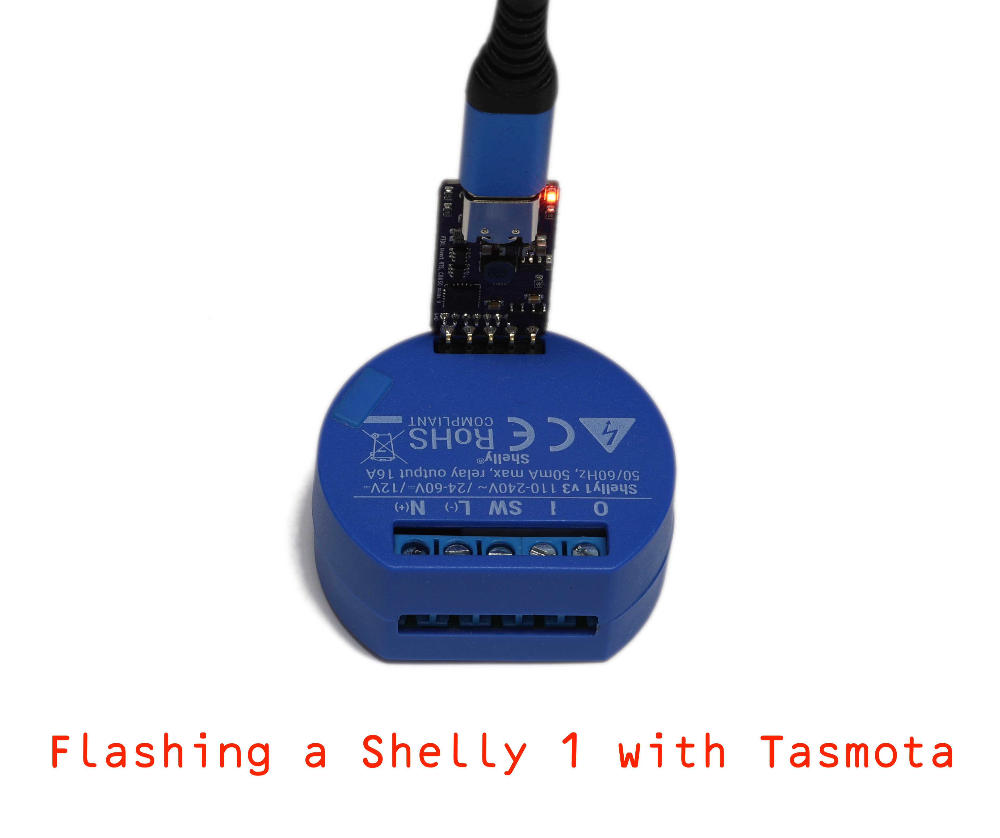
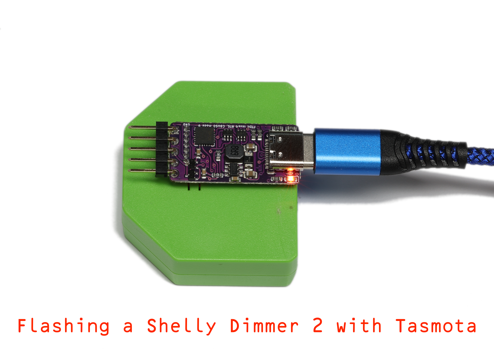

# Tasmotizer-PCB

USB-C connected serial and power for using tasmotizer with a variety of boards using 5 or 6 pin headers.

*Ideal for reflashing Shelly modules, but also works with most of my PCB designs*

- Very small USB-C connected module
- Includes 3.3V regulator to correctly power the Shelly (unlike many serial leads that just pass 5V from USB)
- Has 5 x 2.54mm pins for Shelly 1
- Has 7 x 1.27mm pins for Shelly Plus 1, and all the later models.
- RST on serial RTS, GPIO0 on serial DTR, works with esp flash tool
- On 5 pin header (which has no RST) the RTS controls power, so will power cycle instead of reset
- Works seamlessley with tasmotizer web flash, and esptool from ESP IDF
- Tx/Rx/GPIO/RST have BAV99 diodes for ESD protection
- LED on Tx (CBUS0 so configuable in FTDI) shows working
- 3D printed case design included

*Note FTDI config requires inverted RTS line, and ideally the LED setting on Tx. Tools are included to do this.*

Available to purchase [A&A}(https://www.aa.net.uk/etc/circuit-boards/)

