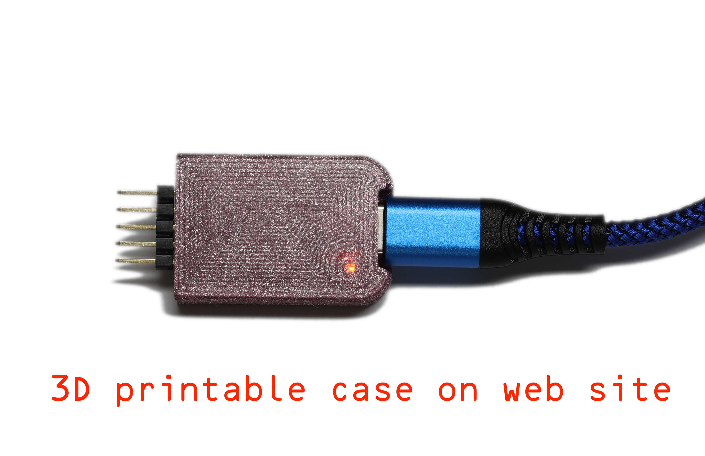

# Tasmotizer-PCB

USB-C connected serial and power for using tasmotizer with a variety of boards using 5 or 7 pin headers.

*Ideal for reflashing Shelly modules, but also works with most of my PCB designs*

- Very small USB-C connected module
- Includes 3.3V regulator to correctly power the Shelly (unlike many serial leads that just pass 5V from USB)
- Works seamlessley with tasmotizer web flash, and esptool from ESP IDF
- Tx/Rx/GPIO/RST have BAV99 diodes for ESD protection
- LED on Tx (CBUS0 so configuable in FTDI) shows working
- 3D printed case design included

*Note FTDI config requires inverted RTS line, and ideally the CBUS0 LED setting on Tx. Tools are included to do this.*

Available to purchase [A&A](https://www.aa.net.uk/etc/circuit-boards/) (UART is already set up on these).

## Pin out

The use of `DTR` and `RTS` on the serial port allow flashing of most ESP device without any additional `BOOT` or `RESET` buttons needed, and work directly with the `esptool` from the ESP IDF, and the tasmota web installer page. As the 5 pin header does not have `RST` the `RTS` switches the power to force a restart of the device. The 7 pin header has an `RST` to do reset.

### 5 pin header (ideal for Shelly 1, and most of my PCBs on this GitHub)

Standard 0.1" (2.54mm) spaced, square pin, header.

|Pin|Use|
|---|---|
|`1`|`GND`|
|`2`|`GPIO0` tied to `DTR` on serial port|
|`3`|`3V3` power, switched by `RTS` on serial port|
|`4`|`RXD` data to device|
|`5`|`TXD` data from device|

### 7 pin header (ideal for most other Shelly devices)

Small 0.05" (1.27mm) spaced, square pin, header.

|Pin|Use|
|---|---|
|`1`|`GND`|
|`2`|`GPIO0` tied to `DTR` on serial port|
|`3`|`RST` tied to `RTS` on serial port|
|`4`|`3V3` power|
|`5`|`RXD` data to device|
|`6`|`TXD` data from device|
|`7`|Not connected|

## Pictures

